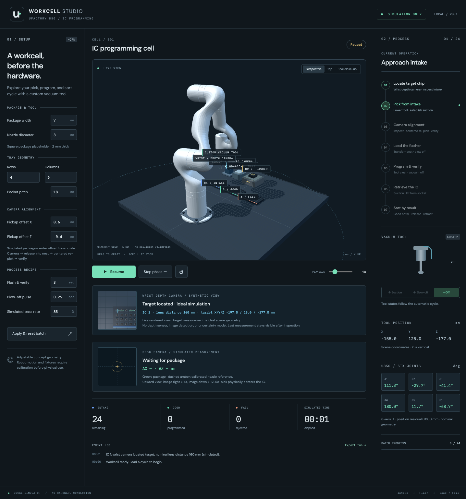
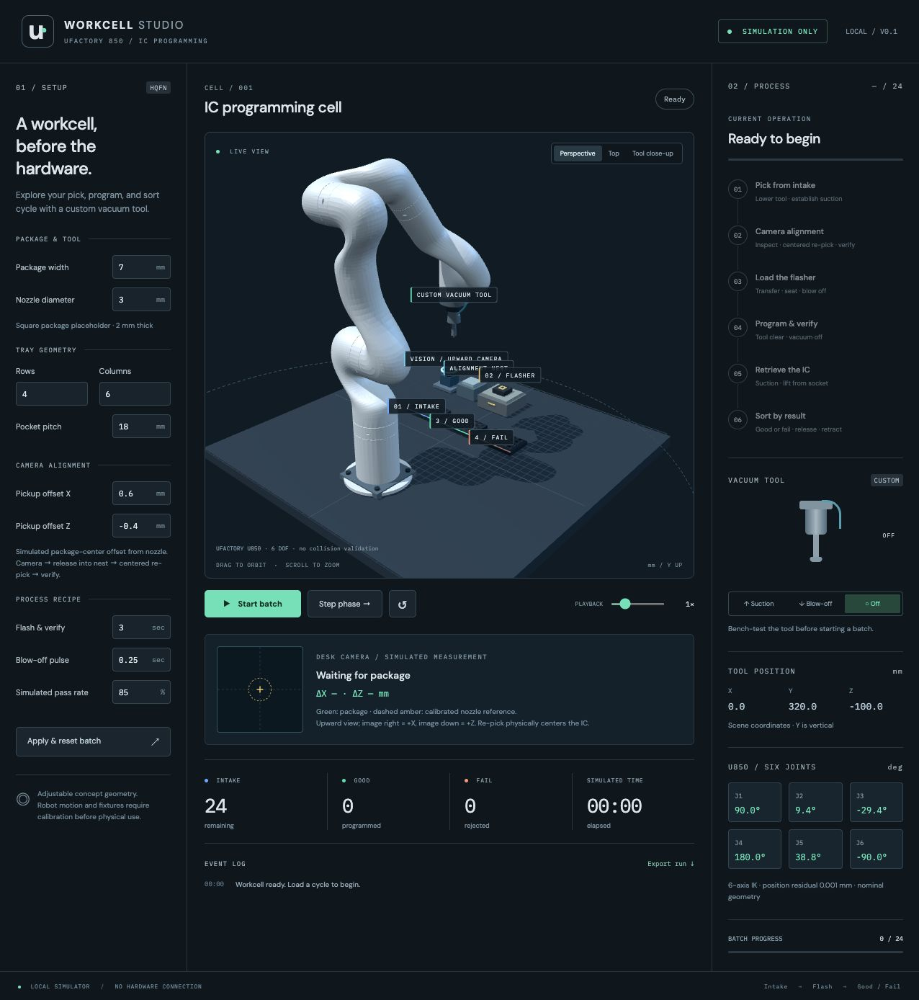
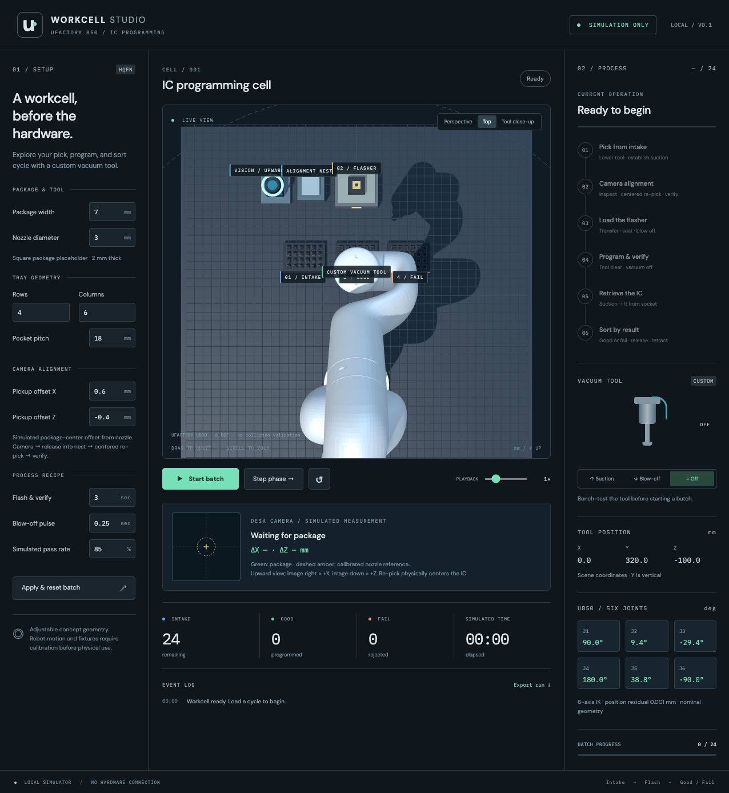
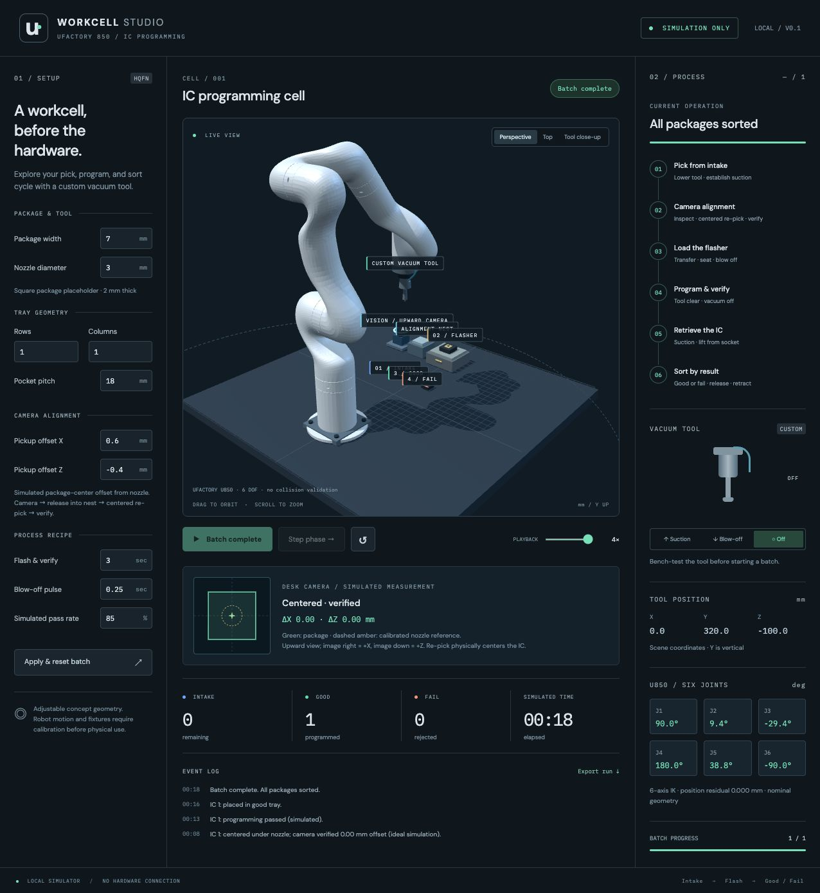
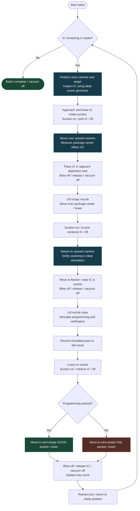

# U850 Simulator

A local, browser-based 3D concept simulator for an UFACTORY 850 workcell:

**Intake tray → wrist depth-camera inspection → vacuum pickup → camera inspection → centered re-pick → camera verification → flasher → good or fail tray.**

The custom tool has three mutually exclusive commands: **suction**, **blow-off**, and **off**. This application does not connect to a robot, programmer, valve, or other physical hardware.

Vendor design and installation brief: [Robot_spec.md](Robot_spec.md).

## Screenshots

### Wrist camera target inspection

The downward wrist camera has located the first intake chip; the cycle is paused before the nozzle approaches. Captured on 2026-09-21 with default geometry. The small camera view is synthetic imagery.



### Six-axis robot and workcell

Official UFACTORY U850 geometry, custom vacuum tool, three trays, flasher, upward camera, and adjacent alignment nest.



### Workcell layout

Top view of the side-by-side intake, good, and fail trays, with the camera, alignment nest, and flasher behind them.



### Camera alignment result

A completed one-package demonstration: the simulated initial offset of X=+0.60 / Z=−0.40 mm is corrected by releasing and re-picking the package. The inspection panel reports zero residual in the ideal model, and the package is sorted into the good tray.



The three earlier screenshots above were captured from the running application on 2026-09-20, before the wrist camera was added. The overview/layout use the default 4×6 trays; the result uses 1×1 trays and 4× playback. These show simulated measurements, not physical robot accuracy.

## Features

- Official U850 visual meshes and six-axis inverse kinematics with joint limits and live J1–J6 readouts.
- Adjustable HQFN package, vacuum nozzle, tray geometry, pickup offsets, and process timing.
- Suction, blow-off, and off states with an automatic pick, align, program, and sort cycle.
- Wrist-mounted downward depth-camera concept with a live synthetic view and pre-pick target inspection.
- Desk-mounted upward camera and neighboring alignment nest for simulated centering.
- Pause/resume, phase stepping, playback speed, orbit/top/tool views, event logs, and JSON run export.

## Run locally

Requires Node.js 20.19+ or 22.12+ and npm.

```bash
npm ci
npm run dev
```

Open the local URL printed by Vite, normally http://127.0.0.1:5173/.

Use **Start batch**, **Pause / Resume**, **Step phase**, and **Reset batch**. A step completes one process phase and then pauses at the start of the next phase. Drag to orbit, scroll to zoom, or select the top view and tool close-up. Close-up frames the current tool position; it does not follow subsequent motion.

Edit the recipe while idle or paused, then click **Apply & reset batch**. Applying settings clears the current run. The playback speed control changes simulation speed without changing recipe durations. Refreshing the page restores defaults. **Export run** downloads the current configuration, inventory, results, and event history as JSON; it is a snapshot rather than a resumable project file.

## Default concept geometry

| Parameter | Initial value |
| --- | --- |
| Package | Square HQFN placeholder, 7 × 7 × 2 mm |
| Vacuum nozzle | 3 mm diameter |
| Each tray | 4 rows × 6 columns, 18 mm pitch |
| Programming and verification | 3 simulated seconds |
| Blow-off pulse | 0.25 simulated seconds |
| Simulated pass probability | 85% per IC |

Package width, nozzle diameter, tray rows/columns/pitch, programming duration, blow-off duration, pass probability, and playback speed are adjustable. All three trays share one geometry. The trays sit side by side in intake → good → fail order along the X axis, with a 30 mm edge-to-edge gap that stays constant as tray width changes. Their common Z position is −150 mm; the flasher sits behind them at Z=−350 mm. Tray placement and robot pocket targets share `stationPosition` in `src/simulation.js`. The scene uses millimetres with **Y up**; these are not robot-controller coordinates.

Nozzle diameter must be smaller than the package. Pitch must leave at least 4 mm between packages. These are simple concept-model constraints, not mechanical design validation. The 2 mm package thickness, socket geometry, vacuum tool shape, approach clearances, and fixture positions are placeholders awaiting actual part drawings and CAD.

## Workflow flowchart

The diagram follows the implemented simulation cycle. Suction holds the IC during transport; a timed blow-off pulse releases it, followed by the off state.



**Simulation behavior:** every IC goes through the nest and re-pick sequence, even if its initial offset is zero. Centering verification assumes an ideal successful re-pick; there is no alignment-failure or retry branch. Programming pass/fail is generated using the configured probability and repeatable random sequence.

**Controls and motion faults:** Pause freezes the cycle and retains the current vacuum state; Resume continues it. Step phase completes one phase and then pauses. Every Cartesian motion update is checked by the six-axis IK solver. If it cannot find an accepted pose within joint limits, the simulation pauses before accepting that update or its associated action, retains the last accepted pose and vacuum state, and requires a batch reset before restarting. Reset clears all progress and restores the intake inventory.

## Process and vacuum behavior

1. Position the wrist camera over the selected intake chip and record its ideal target coordinates. Shift the nozzle above the pocket, descend, establish suction, and attach the IC.
2. Lift clear and present the package to the desk-mounted upward camera. Measure the simulated X/Z offset from the calibrated nozzle center.
3. Place the package in the alignment nest, release it, reposition the nozzle over its center, and re-pick. Return to the camera to verify centering, then transfer to the flasher.
4. Apply a timed blow-off pulse, detach the IC, and turn the tool off.
5. Lift clear, simulate programming and verification, and produce a pass/fail result.
6. Descend, establish suction, and retrieve the IC.
7. Transfer to the next available pocket in the corresponding good or fail tray, blow off, turn the tool off, and retract.

Results use a deterministic pseudo-random sequence reset with each batch. The pass rate is a probability, not a guaranteed quota. Tests force 0% and 100% to exercise both routing paths. The flasher is an idealized open socket: no lid, clamp, electrical contact model, firmware image, or programmer protocol is implemented.

The vacuum bench-test buttons work before/after a batch, and lock while a cycle exists, including when paused. A pause freezes the simulated motion and tool state. Starting a batch sets the tool off before the first approach. There is no pneumatic pressure, airflow, adhesion, seal-loss, or force simulation. The IC attaches after the suction dwell and detaches at the end of the blow-off pulse.

## Robot fidelity and implementation

The robot uses **UFACTORY's official nominal U850 six-revolute-joint URDF chain and visual STL meshes**, pinned to `xArm-Developer/xarm_ros` commit `aad7e1611c9c46eb719045414394bfdd42dcb0f8`. The original files, source record, and redistribution license are retained in `public/models/uf850/` and included in the build. Mesh shape is official; the uniform rendered finish and custom vacuum tool remain simplified.

Source: [official U850 model](https://github.com/xArm-Developer/xarm_ros/tree/aad7e1611c9c46eb719045414394bfdd42dcb0f8/xarm_description/urdf/uf850), [nominal origins](https://github.com/xArm-Developer/xarm_ros/blob/aad7e1611c9c46eb719045414394bfdd42dcb0f8/xarm_description/config/kinematics/default/uf850_default_kinematics.yaml), and [published DH parameters](https://docs.supportarticle.ufactory.cc/support_articles/developer/kinematic-and-dynamic-parameters/ufactory-850.html).

The renderer and inverse kinematics use the same forward chain. Each joint rotates about its URDF-local Z axis after the fixed joint-origin transform. URDF roll/pitch/yaw uses Rz(yaw) Ry(pitch) Rx(roll). Source angular precision is retained. Robot-frame coordinates map to the scene as `(x, y, z) → (x, z, 220−y)` mm. The modeled flange-to-nozzle-tip offset is 101 mm along the flange's local +Z axis. The nozzle and any held IC are attached to the resulting flange transform, rather than drawn independently at a commanded Cartesian location.

A damped least-squares solver controls all six pose components and keeps a fixed downward tool orientation (robot-frame roll π, pitch/yaw 0). Each motion update starts from the previous joint solution to preserve branch continuity. The solver enforces these nominal URDF limits:

| Joint | Range (degrees, rounded) |
| --- | --- |
| J1 | −360 to +360 |
| J2 | −132 to +132 |
| J3 | −242 to +3.5 |
| J4 | −360 to +360 |
| J5 | −124 to +124 |
| J6 | −360 to +360 |

Acceptance requires flange position error below 0.02 mm and orientation error below 0.0002 radians. These are numerical solver tolerances, **not physical robot accuracy**. The joint panel shows all six joint angles and flange position residual. The tool position panel shows the commanded TCP in scene coordinates. Exported runs include joint angles in radians, solver residuals, and any motion fault.

An unsolved target pauses the process before accepting that motion update or its pick/release action; reset the batch to clear the fault. The last accepted pose remains visible. There is no automatic recovery or global IK branch search. Model-load failure disables Start/Step rather than substituting a different arm.

This is a nominal kinematic simulation, not a calibrated digital twin or physical robot program. It does not validate collisions, dynamics, payload, self-intersection, joint velocity/acceleration, or singularity avoidance. The custom tool, camera, trays, and nest still require real geometry and calibration. Motion follows eased Cartesian segments; 220 mm/s sets segment duration but is not an enforced robot speed. Simulated time excludes renderer lag and caps each frame at 0.1 seconds. Playback acceleration is visualization-only and throughput is not measured hardware performance.

- `src/simulation.js`: deterministic process engine, inventory, settings validation, and vacuum states.
- `src/kinematics.js`: official nominal joint transforms, forward kinematics, limits, and numerical six-axis IK.
- `src/scene.js`: Three.js workcell, official U850 link meshes, attached vacuum tool, and orbit controls.
- `src/main.js`: setup, controls, progress, event log, and JSON export.
- `tests/simulation.test.js`: process regression tests.

## Testing

Verified on macOS with Node.js **v25.9.0**, npm **11.12.1**, Vite **7.3.6**, and Three.js **0.180.0**. Dependency versions are locked in `package-lock.json`.

Run:

```bash
npm test
```

Expected summary (exit code **0**):

```text
ℹ tests 19
ℹ suites 0
ℹ pass 19
ℹ fail 0
ℹ cancelled 0
ℹ skipped 0
ℹ todo 0
```

The test runner also prints one passing line per case. Timing output varies. Tests cover all-pass, all-fail, deterministic mixed results, unique destination slots, inventory conservation, vacuum-off flashing, pause/resume, phase stepping, manual-tool interlocks, mid-cycle reset, invalid geometry, pocket spacing, and one-/64-pocket batches.

Run:

```bash
npm run build
```

Expected output (exit code **0**, hashes/sizes/timings vary):

```text
vite v7.3.6 building client environment for production...
transforming...
✓ 12 modules transformed.
rendering chunks...
computing gzip size...
dist/index.html
dist/assets/index-<hash>.css
dist/assets/index-<hash>.js
✓ built in <duration>
```

Vite emits a non-fatal warning because the Three.js-containing JavaScript bundle exceeds 500 kB before gzip (about 143 kB gzipped in the six-axis build).

## Wrist depth camera and pre-pick inspection

A downward-looking concept depth module is mounted beside the nozzle and travels with the solved flange/tool pose. Before every pickup, the robot places the camera over the selected chip and pauses for a 0.6 s inspection. It then shifts the nozzle over the chip and descends. **Step phase** now first pauses at **Inspect target chip**, then at **Approach intake**.

The new wrist panel shows a live rendered view from the camera's pose. It is synthetic imagery, not a sensor stream or depth map. The last inspection reports the chip ID, nominal lens distance and ideal target coordinates in scene X/Y/Z. Readings clear for the next chip and on reset. Run export schema version 3 adds `depthVision` and each part's `prePickInspection`; the upward-camera results remain separate.

The lens is offset −42 mm in tool X and 60 mm above the tip. At inspection, the tip is 100 mm above the chip, giving a nominal 160 mm lens-to-chip distance; the view uses a square 50° field of view. These fixed concept settings are centralized in `DEPTH_CAMERA`. They are not a selected camera's specifications. There is no depth reconstruction, target detection, noise, occlusion validation, confidence threshold or missing-part recovery. Targets are the known tray coordinates; deliberate pickup offsets still demonstrate the separate upward-camera/nest centering process.

The vendor must select and validate camera range, optics, lighting, calibration, precision and mounting with actual ICs and trays. See [Robot_spec.md](Robot_spec.md) for requirements and open decisions.

Wrist-camera change validation: `npm test` returns **19 passed / 0 failed**, exit **0**. The new regression checks observation before suction, camera/target positioning, pause without premature measurement, per-chip records and reset. Existing full-batch and continuous six-axis trajectory tests also include the new observation motions. `npm run build` exits **0**, with 12 modules transformed and the existing bundle-size warning. Timing and asset hashes vary.

Browser acceptance on 2026-09-21: an isolated Chrome session with software WebGL displayed both camera panels. Stepping paused before measurement, then reported IC 1 at X/Y/Z −197.0 / 25.0 / −177.0 mm with a nominal lens distance of 160 mm. A 1×1, 100%-pass batch at 4× completed with **1 good / 0 fail**, **Centered · verified**, an empty motion-error field and no JavaScript runtime exceptions. Default settings were restored after the cycle.

## Desk camera and centering

An upward-looking camera module with a lens and ring light is mounted on the desk. Its inspection point is X=−235, Y=140, Z=−350 mm. The alignment nest is immediately beside the camera at X=−130, Y=55, Z=−350 mm (105 mm between centers, approximately 24.5 mm between fixture edges). Its package top surface is at Y=55 mm. Both fixtures are schematic.

The pickup-offset controls inject a known package-center displacement relative to the nozzle (default X=+0.6, Z=−0.4 mm). The grasp model preserves this offset during motion. The robot places the package center at the nest center, turns suction off after a blow-off pulse, moves the empty nozzle to the package center, and re-picks it. Only this re-pick changes the relative offset to zero. A second inspection records the centered result before flashing.

The camera panel displays the last simulated measurement, not a live video feed: green is the package outline/center and dashed amber is the calibrated nozzle reference. An actual upward camera may not see the nozzle behind the package; the reference here represents a prior nozzle calibration. Image right is +X and image down is +Z under the simulator's chosen camera convention. No image detection, camera calibration, lens distortion, lighting physics, rotational correction, measurement noise, or alignment-failure handling is implemented. Verification assumes ideal re-picking; zero residual is a model result, not a hardware accuracy claim. Export schema version 3 includes each part's before/after alignment result and the last inspection.

The camera milestone originally passed 13 tests; the current complete suite has 19 tests. Added coverage verifies positive/negative/zero offsets, release before nozzle repositioning, invariant package position in the nest, centered re-picking, pause/reset behavior, invalid pickup offsets, and successful alignment before programming. `npm run build` exits 0; the existing bundle-size warning remains.

After moving the nest beside the camera, all 13 tests and the build pass again. Browser acceptance: a one-part run at 4× measured X=+0.60, Z=−0.40 mm, completed the centered re-pick, displayed **Centered · verified** with ΔX=0.00 and ΔZ=0.00 mm, and finished with **1 good / 0 fail**. No browser errors or warnings were recorded. The top view confirms the adjacent fixtures. Default 4×6 trays and 1× playback were restored afterward.

## Six-axis validation

At the original six-axis milestone, `npm test` exits **0** with **18 passed, 0 failed**. `npm run build` exits **0** (12 modules transformed; the documented non-fatal bundle-size warning remains). The original process tests now execute through IK, including one-/64-pocket batches and forced pass/fail routing. Five kinematic checks additionally verify:

- URDF forward kinematics against an independent implementation of the published standard DH table at three different six-joint poses; agreement within 0.02 mm and 0.00005 radians, accounting for rounded source RPY constants.
- Camera, nest, flasher, home, and outer tray corners: target TCP error below 0.05 mm, downward tool orientation, and all joint limits respected.
- An unreachable 3-metre target fails to solve.
- Failed motion leaves the accepted joint pose, TCP, phase time, and inventory unchanged and pauses the process.
- A full two-part alignment/programming/sorting trajectory at 20 ms increments has no numerical branch jumps above 0.1 rad per sample and maintains TCP error below 0.05 mm. This continuity check does not establish hardware velocity limits.

Browser acceptance with the official meshes: inspected the articulated arm and flange-attached tool in perspective view, then completed a one-part run at 4×. Expected/observed: **Centered · verified**, **1 good / 0 fail**, **Batch complete**, six joint readouts, and no browser warnings/errors. Restored 4×6 trays and 1× playback afterward. The mesh assets total approximately 2.4 MB and are served locally; no external model service is required.

## Documentation

- [Vendor hardware and installation specification](Robot_spec.md)
- [Historical validation notes](docs/validation-history.md)
- [Screenshot files and capture instructions](docs/screenshots/README.md)
- [Official model provenance](public/models/uf850/SOURCE.md)
- [UFACTORY model license](public/models/uf850/LICENSE)

The robot assets retain their upstream license. This project is not an official UFACTORY product.

## Deploy to GitHub Pages

This repository includes a manually triggered deployment workflow. Pushing code alone does not publish the site.

1. Push the completed project to the `main` branch of `patthananb/U850_Simulator`.
2. Open [repository Pages settings](https://github.com/patthananb/U850_Simulator/settings/pages).
3. Under **Build and deployment**, set **Source** to **GitHub Actions**.
4. Open [Actions](https://github.com/patthananb/U850_Simulator/actions), select **Deploy to GitHub Pages**, then click **Run workflow**. Choose **main** and confirm **Run workflow**.
5. Wait for both **build** and **deploy** to finish successfully. Build installs locked dependencies, runs the regression tests, builds the app, and uploads `dist/`.
6. Open [the deployed simulator](https://patthananb.github.io/U850_Simulator/). This URL works only after a successful deployment.
7. For future updates, push the changes and run the workflow again. If a run fails, open its failed step to see the error.

`vite.config.js` sets the production base to `/U850_Simulator/`; development stays at `/`. Robot meshes load relative to Vite's base, so they work under the repository subpath. Change the base if the repository is renamed or a custom domain is added. The workflow deploys only from `main` and preserves the model license in the published files.

To preview the production build locally:

```bash
npm run build
npx vite preview --host 127.0.0.1 --base /U850_Simulator/
```

Open `http://127.0.0.1:4173/U850_Simulator/`. Expected: the six-axis robot meshes load, Start batch is enabled, and the simulator runs under the same subpath used by Pages. The preview command stays running until stopped with Ctrl+C.

Pages preparation validation: `npm test` returned 18 passed / 0 failed (exit 0), and `npm run build` returned exit 0 with 12 modules transformed and the existing bundle-size warning. The production preview returned HTTP 200 for `/U850_Simulator/`, the base and final-link STL files, and the model license. The generated HTML references `/U850_Simulator/assets/`.
